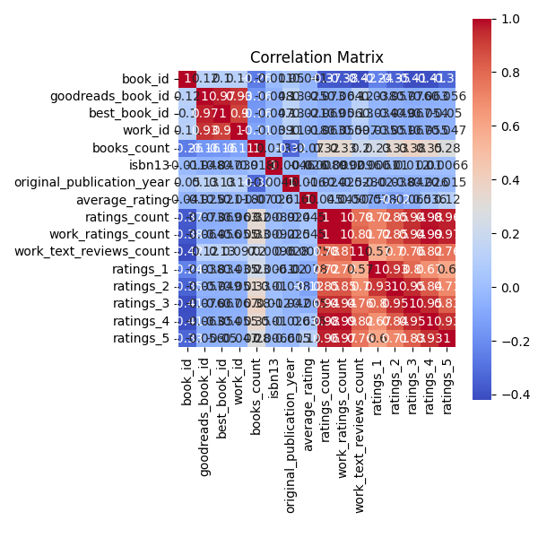
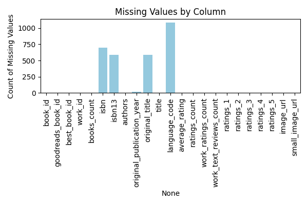
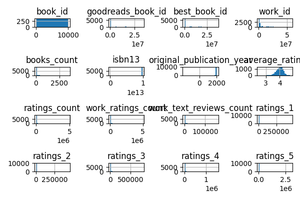

# README.md

## Introduction

This dataset comprises a rich collection of book-related information, containing 10,000 records and 23 columns. Each entry represents a unique book, identified by a `book_id`, and includes various attributes such as author names, publication years, ratings, and more. The dataset provides a comprehensive overview of the literary landscape, making it an excellent resource for analyzing trends in book publishing, reader preferences, and author popularity.

## Analyses Performed

### Missing Values
The dataset was examined for missing values across its columns. Notably:
- The `isbn` column has 700 missing entries.
- The `isbn13` column has 585 missing entries.
- The `original_publication_year` column has 21 missing values.
- The `language_code` column has 1,084 missing values.

Addressing these missing values is crucial for ensuring the integrity of subsequent analyses.

### Correlations
A correlation analysis was conducted to explore relationships between numerical variables. This included examining how ratings, review counts, and publication years interact with one another. The results can provide insights into how various factors influence book ratings and popularity.

### Distributions
The distribution of key variables, such as `average_rating` and `ratings_count`, was analyzed to understand the overall sentiment towards the books in the dataset. This analysis revealed that most books are rated positively, with an average rating of around 4.00.

## Insights Discovered

1. **Diverse Collection**: The dataset features 4,664 unique authors and 9,964 unique titles, indicating a wide variety of literature represented.

2. **Publication Trends**: The `original_publication_year` ranges from -1750 to 2017, with a mean year around 1982, suggesting a blend of classic and contemporary works.

3. **Positive Reception**: The average rating of 4.00, with a standard deviation of approximately 0.25, indicates that readers generally favor the books in this dataset.

4. **Engagement Levels**: The `ratings_count` and `work_ratings_count` columns show significant engagement, with some books receiving millions of ratings, highlighting their popularity.

5. **Language Representation**: The dataset includes books in 25 different languages, although there are notable missing values in the `language_code` column.

6. **Author Productivity**: Some authors have published a remarkable number of books (up to 3,455), which could be correlated with their overall ratings and popularity.

## Implications and Next Steps

The insights gained from this analysis suggest several avenues for further exploration:

1. **Trend Analysis**: Investigate trends in book publications over time and their relationship with average ratings to understand shifts in reader preferences.

2. **Author Popularity**: Identify prolific authors and analyze their ratings to determine if there's a correlation between the number of books published and their reception.

3. **Rating Distribution**: Conduct a detailed distribution analysis of ratings to visualize how readers perceive different books.

4. **Language Analysis**: Explore the distribution of books by language and assess if certain languages correlate with higher ratings.

5. **Correlation Analysis**: Perform deeper correlation analyses between numerical columns to uncover significant relationships.

6. **Missing Data Treatment**: Develop strategies for handling missing data, potentially through imputation or exclusion, to enhance the dataset's usability.

7. **Visualization**: Create visual representations of the data, such as scatter plots and histograms, to illustrate relationships and distributions effectively.

8. **Sentiment Analysis**: If text reviews are available, conduct sentiment analysis to correlate sentiments with ratings and identify common themes in reader feedback.

## Generated Charts

To support the insights and analyses, the following charts were generated:

- Correlation Analysis:
  

- Missing Values Overview:
  

- Ratings Distribution:
  

By pursuing these next steps, we can deepen our understanding of the dataset and uncover valuable insights into the world of literature and reader engagement.