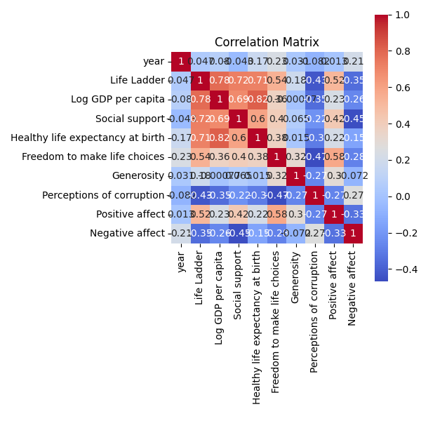
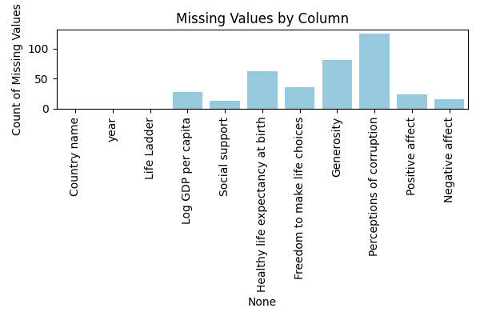
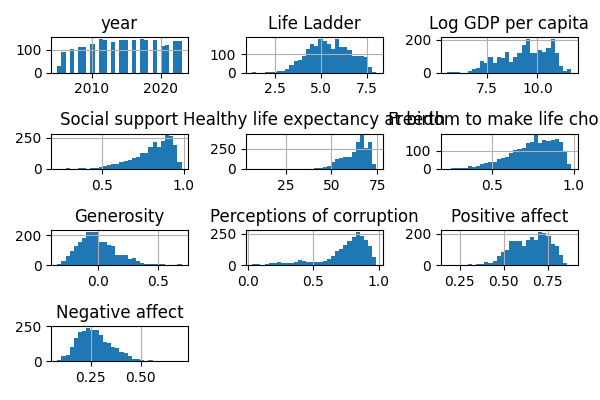

# README.md

## Introduction

This dataset encompasses a comprehensive collection of well-being indicators across 165 countries over a span of 19 years, from 2005 to 2023. With a total of 2,363 entries and 11 variables, it provides a rich foundation for analyzing various aspects of life satisfaction, economic conditions, social support, and health outcomes. The dataset includes key metrics such as the Life Ladder, Log GDP per capita, and perceptions of corruption, allowing for a multifaceted exploration of factors influencing well-being globally.

## Analyses Performed

### Missing Values
The analysis revealed that certain variables contained missing values:
- **Log GDP per capita**: 28 missing values
- **Social support**: 13 missing values
- **Healthy life expectancy at birth**: 63 missing values
- **Freedom to make life choices**: 36 missing values
- **Generosity**: 81 missing values
- **Perceptions of corruption**: 125 missing values
- **Positive affect**: 24 missing values
- **Negative affect**: 16 missing values

These missing values may require attention through imputation or exclusion, depending on the analytical approach taken.

### Correlation Analysis
A correlation analysis was conducted to explore the relationships between key variables. This analysis helps to identify potential drivers of well-being and understand how different factors interact with one another.

### Distribution Analysis
The distribution of key variables was examined to understand their spread and central tendencies. This included assessing the mean, standard deviation, minimum, and maximum values for each variable, providing insights into the variability and overall trends within the dataset.

## Insights Discovered

1. **Life Ladder**: The average Life Ladder score is approximately 5.48, indicating a moderate level of life satisfaction. The range (1.281 to 8.019) suggests significant disparities in life satisfaction across different countries.

2. **Economic Conditions**: The mean Log GDP per capita is around 9.40, reflecting a wide range of economic conditions. This variability may correlate with life satisfaction levels.

3. **Social Support**: With an average score of 0.81, individuals generally report a moderate to high level of social support, although there is notable variability.

4. **Health Outcomes**: The average healthy life expectancy is approximately 63.4 years, highlighting disparities in health outcomes among countries.

5. **Freedom and Generosity**: The perception of freedom to make life choices is relatively high (mean: 0.75), while the average generosity score is near zero, indicating low levels of reported generosity across the dataset.

6. **Affect Variables**: On average, individuals report more positive affect (mean: 0.65) than negative affect (mean: 0.27), suggesting a generally positive emotional state among respondents.

### Generated Charts
The following charts illustrate key findings from the analysis:

- Correlation between variables:
  

- Missing values distribution:
  

- Distribution of Life Ladder scores:
  

## Implications and Next Steps

The insights derived from this analysis highlight the importance of understanding the interplay between economic, social, and health factors in influencing well-being. Here are some suggested next steps:

1. **Trend Analysis**: Conduct a longitudinal analysis to observe how well-being indicators have evolved over the years.

2. **Deeper Correlation Analysis**: Investigate specific relationships between variables, such as the impact of GDP on life satisfaction.

3. **Comparative Country Analysis**: Perform comparative analyses to identify which countries excel or lag in various well-being indicators.

4. **Cluster Analysis**: Utilize clustering techniques to group countries based on similar characteristics, revealing patterns in well-being outcomes.

5. **Address Missing Data**: Develop strategies to handle missing data, ensuring robust analyses moving forward.

6. **Predictive Modeling**: Build predictive models to forecast future trends in well-being indicators, aiding policymakers in planning and intervention strategies.

By pursuing these analyses, we can gain a deeper understanding of the factors influencing well-being across different countries and over time, ultimately informing policies aimed at improving quality of life globally.