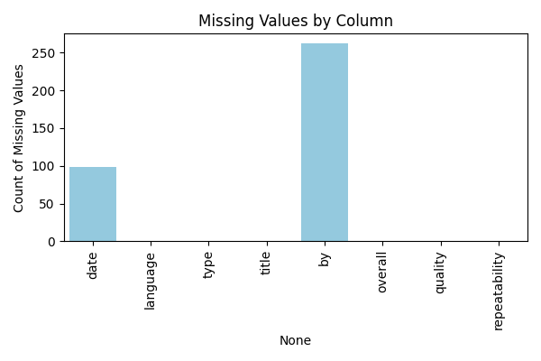
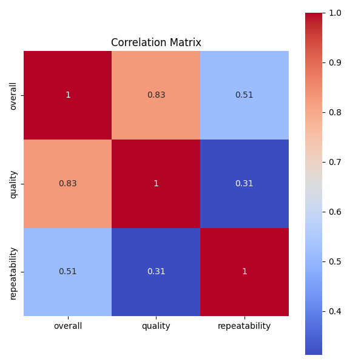
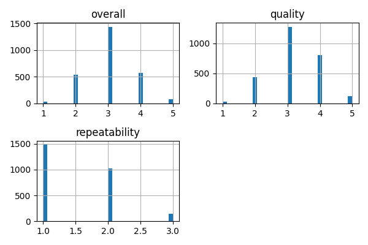

```markdown
# README.md

## Introduction

This dataset comprises **2652 entries** across **8 attributes**, providing a rich source of information for analyzing various media content. The attributes include details such as the date of release, language, type of content, title, creators, and ratings. The dataset is particularly diverse, featuring content in **11 different languages** and encompassing various types, including movies, series, and non-fiction. 

## Analyses Performed

### Missing Values Analysis
The dataset was examined for missing values, revealing:
- The `date` column has **99 missing values**, accounting for approximately **3.7%** of the total entries.
- The `by` column has **262 missing values**, which may impact analyses related to content creators.

### Correlation Analysis
A correlation analysis was conducted on the numerical ratings:
- The `overall` and `quality` ratings, both ranging from **1 to 5**, showed a mean of approximately **3.05** and **3.21**, respectively.
- The `repeatability` rating, which ranges from **1 to 3**, has a mean of **1.49**, indicating that most content is not highly repeatable.

### Distribution Analysis
The distribution of various attributes was analyzed:
- The `language` column features **11 unique languages**, suggesting a diverse set of content.
- The `type` column includes **8 unique types** of content, allowing for comparisons between different categories.
- The `title` column has **2312 unique titles**, indicating a rich dataset with many unique entries.

## Insights Discovered

1. **Diversity of Content**: The dataset showcases a wide range of content types and languages, which can be leveraged to analyze trends and preferences across different demographics.
  
2. **Average Ratings**: The generally average ratings across `overall` and `quality` suggest that while the content is diverse, it may not be exceptionally rated. This could indicate room for improvement in content quality.

3. **Creator Representation**: The presence of **262 missing values** in the `by` column suggests that not all content is attributed to a creator, which may affect analyses related to authorship and content quality.

4. **Temporal Trends**: With **2055 unique dates**, there is potential for time series analysis to explore how content release patterns and ratings evolve over time.

## Implications and Next Steps

The insights derived from this analysis open several avenues for further exploration:

1. **Time Series Analysis**: Investigate trends over time using the `date` column to understand how the volume and ratings of content change.

2. **Language and Content Type Analysis**: Delve deeper into how different languages and content types correlate with ratings to identify potential areas for content development.

3. **Creator Impact**: Explore the influence of different creators on ratings, particularly focusing on those with higher representation in the dataset.

4. **Handling Missing Data**: Assess the implications of missing values in the `date` and `by` columns and consider methods for imputation or further analysis.

5. **Visualization**: Create visual representations of the data to better understand distributions and relationships. Suggested visualizations include:
   - 
   - 
   - 

By pursuing these next steps, we can uncover deeper insights and trends within the dataset, ultimately leading to more informed decisions regarding content creation and curation.
```